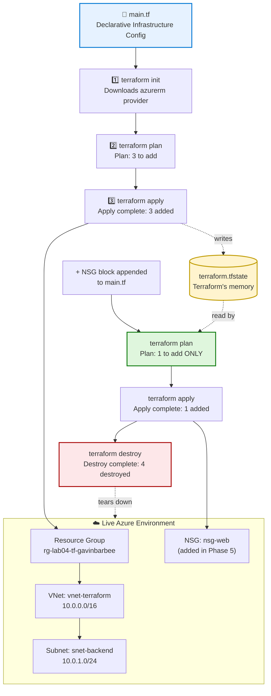

# Infrastructure as Code with Terraform

## 🎬 Watch Me Build This Lab!

https://www.loom.com/share/22844dae4e0342308ee06ac8831d867f

---

## 📖 Project Overview

This project demonstrates **Infrastructure as Code (IaC)** — replacing manual Azure Portal clicks with a declarative configuration file that Terraform reads and executes automatically. Instead of describing *how* to build something step by step, IaC describes *what* the end state should look like, and lets the tool figure out the steps.

Using a single `main.tf` file, this lab deploys a Resource Group, Virtual Network, and Subnet with four commands, then demonstrates the core value of Terraform by adding a Network Security Group to the already-running environment — and watching Terraform update **only** the new resource, leaving everything else untouched. The environment is then torn down cleanly with a single command.

This is the same workflow used to manage production cloud environments at scale — version-controlled, repeatable, and auditable, instead of a one-time sequence of manual portal actions that can't easily be reproduced or reviewed.

**Skills demonstrated:**
- Declarative infrastructure design using HashiCorp Configuration Language (HCL)
- The core Terraform workflow: `init` → `plan` → `apply` → `destroy`
- Understanding Terraform's state file (`terraform.tfstate`) as the source of truth for what exists
- Incremental infrastructure changes — adding resources to a live environment without touching what already exists
- Resource dependency resolution (Terraform automatically sequences RG → VNet → Subnet)
- Using Azure Cloud Shell as a zero-install cloud development environment
- Clean environment teardown using `terraform destroy` instead of manual portal deletion

---

## 🏗️ Architecture Diagram



**How it works:** `main.tf` is the single source of truth describing the desired infrastructure. `terraform init` downloads the Azure provider plugin; `terraform plan` compares the config against Terraform's state file and previews exactly what will change; `terraform apply` executes that plan. The critical moment in this lab is **Phase 5**: after appending an NSG resource block to the *already-applied* `main.tf`, running `plan` again shows **"1 to add"** — not 4. Terraform reads `terraform.tfstate`, recognizes the Resource Group, VNet, and Subnet already exist and are unchanged, and correctly isolates only the new resource. Nothing gets rebuilt or touched unnecessarily.

---

## ✅ Prerequisites

- [ ] Active Azure Subscription
- [ ] Access to the Azure Portal — no local installation required (this lab runs entirely in Azure Cloud Shell)

---

## 🏷️ Naming Conventions Used

| Resource | Value |
|---|---|
| Resource Group | `rg-lab04-tf-gavinbarbee` |
| Virtual Network | `vnet-terraform` |
| Subnet | `snet-backend` — `10.0.1.0/24` |
| NSG (Phase 5) | `nsg-web` |
| Location | East US |

---

## 🪜 Project Steps

### Step 1: Open Cloud Shell and Create the Project Folder

1. Logged into the Azure Portal and opened **Cloud Shell** (`>_` icon, top-right toolbar)
2. Selected **No storage account required** — this lab is self-contained in a single session and ends with a full teardown, so persistent storage wasn't needed
3. Confirmed the shell was in **Bash** mode, not PowerShell
4. Created and entered the project folder:
   ```bash
   mkdir terraform-lab
   cd terraform-lab
   ```

### Step 2: Write the Terraform Configuration

1. Opened the built-in code editor:
   ```bash
   code main.tf
   ```
2. Pasted the full configuration below, describing the provider, Resource Group, Virtual Network, and Subnet — with the Resource Group name already changed from the lab's placeholder to `rg-lab04-tf-gavinbarbee`:

   ```hcl
   # ── 1. Tell Terraform which provider to use ──────────────────────────────
   # The "provider" is the plugin that knows how to talk to Azure.
   # version = "~> 3.0" means use version 3.x — anything from 3.0 upward.
   terraform {
     required_providers {
       azurerm = {
         source  = "hashicorp/azurerm"
         version = "~> 3.0"
       }
     }
   }

   # features {} is required by azurerm even when empty.
   # It enables default behaviors that would otherwise need to be opted into.
   provider "azurerm" {
     features {}
   }

   # ── 2. Resource Group ─────────────────────────────────────────────────────
   # Every Azure resource must live inside a resource group.
   resource "azurerm_resource_group" "rg" {
     name     = "rg-lab04-tf-gavinbarbee"
     location = "East US"
   }

   # ── 3. Virtual Network ────────────────────────────────────────────────────
   # location and resource_group_name reference the resource group above.
   # This creates a dependency — Terraform will create the RG first automatically.
   resource "azurerm_virtual_network" "vnet" {
     name                = "vnet-terraform"
     location            = azurerm_resource_group.rg.location
     resource_group_name = azurerm_resource_group.rg.name
     address_space       = ["10.0.0.0/16"]
   }

   # ── 4. Subnet ─────────────────────────────────────────────────────────────
   # 10.0.1.0/24 is a slice of the 10.0.0.0/16 VNet address space.
   # A VNet can contain many subnets — each is a separate network segment.
   resource "azurerm_subnet" "subnet" {
     name                 = "snet-backend"
     resource_group_name  = azurerm_resource_group.rg.name
     virtual_network_name = azurerm_virtual_network.vnet.name
     address_prefixes     = ["10.0.1.0/24"]
   }
   ```

   > 💡 This exact configuration is also saved as [`main.tf`](main.tf) in this repo — copy it directly from there for your own run-through instead of retyping it from this README.

3. Saved (`Ctrl + S`) and closed the editor (`Ctrl + Q`)
4. Confirmed the file saved correctly:
   ```bash
   cat main.tf
   ```

### Step 3: Initialize Terraform

```bash
terraform init
```

This downloads the `azurerm` provider plugin into a hidden `.terraform` folder and creates a `.terraform.lock.hcl` file locking the exact provider version.

```
Terraform has been successfully initialized!
```


### Step 4: Preview the Plan

```bash
terraform plan
```

This is a **read-only** comparison between `main.tf` and the current state of Azure — nothing is created or changed yet.

```
Plan: 3 to add, 0 to change, 0 to destroy.
```


### Step 5: Apply the Configuration

```bash
terraform apply
```

Typed the full word `yes` when prompted (not just `y`) to confirm. Watched Terraform create the Resource Group first, then the VNet, then the Subnet — resolving the dependency order automatically.

```
Apply complete! Resources: 3 added, 0 changed, 0 destroyed.
```


### Step 6: Inspect the State File

Terraform writes a `terraform.tfstate` file after every apply — this is its permanent record of everything it created. Confirmed it existed in the project folder:

```bash
ls -la
```

```
main.tf
terraform.tfstate
.terraform.lock.hcl
.terraform/
```

> ⚠️ **Note:** `terraform.tfstate` is a JSON file containing full resource details, including subscription and resource IDs. It's deliberately **not** printed here or included in this repo — `cat`-ing the raw file would expose that data on camera/in a screenshot. Confirming it exists via `ls -la` is enough to prove the concept without exposing anything sensitive. This file should also never be committed to a public GitHub repo in real projects, for the same reason.

### Step 7: Verify in the Azure Portal

1. Minimized Cloud Shell and searched **Resource groups** in the Azure Portal
2. Opened `rg-lab04-tf-gavinbarbee` and confirmed `vnet-terraform` and its subnet were present
3. Opened `vnet-terraform` → **Subnets** and confirmed `snet-backend` with address prefix `10.0.1.0/24`


### Step 8: Add a Resource to a Live Environment

This is the core concept the entire lab builds toward.

1. Reopened the editor (`code main.tf`) and appended a new NSG block to the **bottom** of the file, without modifying any existing code:
   ```hcl
   # ── 5. Network Security Group ────────────────────────────────────────────
   # An NSG is a set of firewall rules that controls inbound and outbound traffic.
   # This creates an empty NSG — rules would be added in a real deployment.
   resource "azurerm_network_security_group" "nsg" {
     name                = "nsg-web"
     location            = azurerm_resource_group.rg.location
     resource_group_name = azurerm_resource_group.rg.name
   }
   ```

   The complete `main.tf` at this point — provider block, Resource Group, VNet, Subnet, and the new NSG block all together — matches the final version of [`main.tf`](main.tf) in this repo. Copy the whole file from there if you're following along, rather than typing the NSG block in isolation.

2. Saved (`Ctrl + S`) and closed (`Ctrl + Q`)
3. Ran `terraform plan` again against the live environment:
   ```bash
   terraform plan
   ```
   ```
   Plan: 1 to add, 0 to change, 0 to destroy.
   ```

   **This is the key insight of the lab.** Terraform compared the updated config against `terraform.tfstate`, recognized the Resource Group, VNet, and Subnet already existed and were unchanged, and isolated only the new NSG — without rebuilding or touching anything already running.


4. Ran `terraform apply`, typed `yes`, and confirmed:
   ```
   Apply complete! Resources: 1 added, 0 changed, 0 destroyed.
   ```
5. Refreshed the resource group in the portal and confirmed a fourth resource — `nsg-web` — now appeared alongside the original three, untouched.

### Step 9: Destroy the Environment

Removed every resource Terraform had created with a single command, rather than deleting manually through the portal (which would desynchronize the state file from actual Azure reality).

```bash
terraform destroy
```

Reviewed the destruction plan, confirmed it listed all four resources, typed `yes`, and confirmed:

```
Destroy complete! Resources: 4 destroyed.
```

Verified in the Azure Portal that `rg-lab04-tf-gavinbarbee` no longer appeared in the Resource Groups list.


✅ **Result:** Deployed and modified a live Azure environment entirely through code — no manual portal configuration — and demonstrated Terraform's core value proposition: state-aware, incremental infrastructure changes that touch only what actually needs to change.

---

## 🛠️ Troubleshooting / Common Issues

| Issue | Cause | Fix |
|---|---|---|
| `"Resource Group already exists"` | A resource group with this exact name already exists — from a previous attempt or created manually | Either change the name in `main.tf` to something unique, or delete the existing resource group in the portal first |
| `terraform: command not found` | Cloud Shell dropped to a session where Terraform isn't loaded | Close Cloud Shell and reopen it from the portal toolbar — Terraform is pre-installed in every new session |
| Syntax error on a specific line | A missing closing bracket `}`, missing quote `"`, or stray character introduced while editing | Open the editor (`code main.tf`), go to the line number in the error, and check that every opening `{` has a matching `}` |
| `terraform plan` shows `0 to add` unexpectedly | Terraform already created these resources and the state file records them as existing | If starting fresh is the goal, run `terraform destroy` first, then `apply` again |
| `terraform apply` fails partway through | Transient Azure API error or a quota limit | Run `terraform apply` again — Terraform skips resources that already exist and only retries what failed |
| Editor won't close with `Ctrl + Q` | Some browsers intercept that key combination | Click the **X** button in the top-right corner of the editor panel instead |

---

## 🧹 Cleanup

Cleanup for this lab **is** the final step of the workflow itself — `terraform destroy` (Step 9 above) removes every resource in a single command, keeping the state file and actual Azure environment perfectly in sync. No separate manual cleanup was needed, and none was performed through the portal, since doing so would have left `terraform.tfstate` out of sync with reality.

---

## 💡 Key Takeaways

- **Infrastructure as Code describes the destination, not the directions.** A declarative `main.tf` says *what* should exist; Terraform figures out *how* to get there — including resolving dependency order (Resource Group before VNet before Subnet) automatically.
- **The state file is what makes incremental changes possible.** `terraform.tfstate` is Terraform's memory of what it has already built — without it, every `plan` would have no way to distinguish "already exists" from "needs to be created."
- **"Plan: 1 to add" instead of "4 to add" is the entire point of this lab.** In a real environment with dozens or hundreds of resources, this is what prevents an infrastructure change from accidentally rebuilding or disrupting things that were never meant to change.
- **`terraform destroy` isn't optional cleanup — it's the correct cleanup.** Deleting resources manually through the portal desynchronizes the state file from reality; the next `plan` would then error out trying to reconcile a state that no longer matches Azure.
- **This is how production cloud environments are actually managed at scale.** Manual portal clicks don't version, review, or reproduce — a `main.tf` file does all three, and is the same fundamental workflow used by cloud teams managing real infrastructure.

---

**Author:** Gavin Barbee
**Lab Reference:** Lab 04 — Infrastructure as Code with Terraform
**Difficulty:** Intermediate | **Time to Complete:** ~45 minutes
